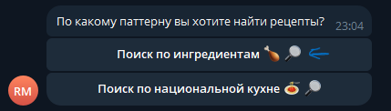
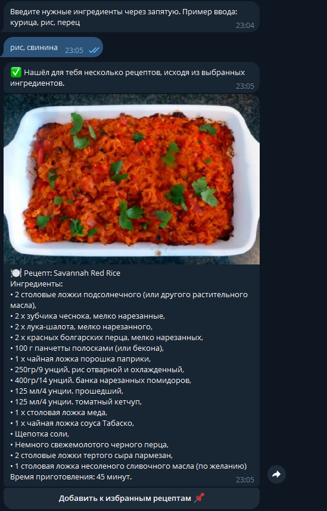
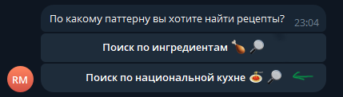
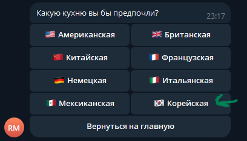
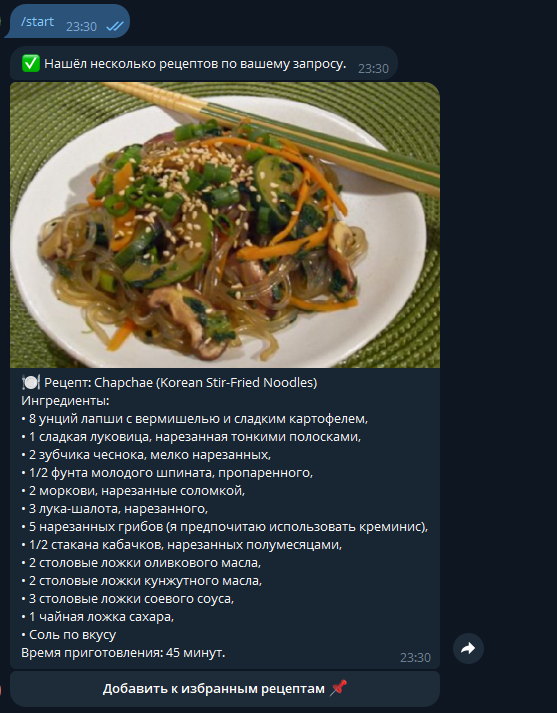

# Бот менеджер рецептов

Телеграм бот для поиска и хранения рецептов на любой вкус. 

## 📌 Возможности
* Поиск рецептов по нескольким параметрам: ингредиентам или национальной кухне.

* Сохранение понравившегося рецепта в избранное (удаление из избранного)

* Перевод ингредиентов у рецепта с английского на русский (название решил не переводить ;>)

* Автоматическая регистрация пользователя, его профиль (наличие подписки, подсчёт кол-ва запросов за день)

## 💻 Стэк технологий
1. __Бот__: *Python, aiogram 3+*
2. __База данных__: *PostgreSQL*
3. __API__: *[Spoonacular API](https://spoonacular.com/food-api/docs)*
4. __Дополнительно__: *Docker, Redis* (Redis используется для кэширования переводов ингредиентов)

## 🤖 Функционал бота, команды
Основная команда бота - */start*; вся логика работает через инлайн кнопки.

__Пример поиска по ингредиентам (рис, свинина)__:
     
    

__Пример поиска по национальной кухне (корейская)__:
     
     
    

